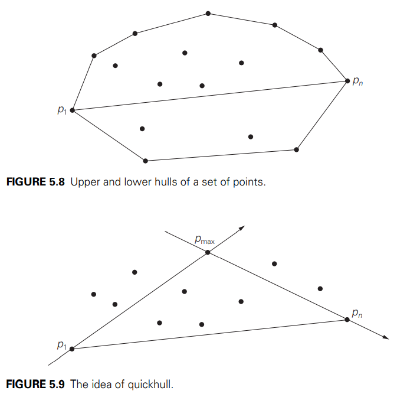

# 分治法

>用递归树方法解$T(n) = 2T(n/2)+n/\lg n$。

将树展开到第k层，$T(n/2^k)$，并且假设$2^k = n (k = log_2 n)$方便计算，

第k层的每个节点的代价为$(n/2^k)/\log_2 (n/2^k)$，而第k层一共有$2^k$个节点，因此第k层的
总代价为$n/\log_2(n/2^k) = n/(log_2 n-k)$。

计算全部k层代价之和，

$$
\begin{aligned}
\sum_{k=0}^{\log_2 n -1} \frac{n}{\log_2 n - k} = & \frac{n}{\log_2 n}+
\frac{n}{\log_2 n - 1} + \cdots + \frac{n}{2} + \frac{n}{1} \\
=& n\sum_{k=1}{\log_2 n} \frac{1}{k} \\
=& n(\log_2 \log_2 n + O(1)) \\
=& \Theta (n \log_2 \log_2 n)
\end{aligned}
$$

## 主定理

$$
T(n) = aT(n/b) + f(n), \quad a \ge 1, b \gt 1, f(n) \gt 0
$$

$$
T(n) = \begin{cases}
\Theta(n^{\log_b^a}) \quad \text{if} f(n) \in O(n^{\log_b a - \epsilon}), \epsilon > 0 \\
\Theta(n^{\log_b^a} \lg^{k+1} n) \quad \text{if } f(n) \in \Theta(n^{\log_b a}{ \lg^k n}), k \ge 0 \\
\Theta(f(n)) \quad {\text{if} f(n) \in \Omega (n^{\log_b a + \epsilon}), \epsilon > 0}
\end{cases}
$$

正则条件

$$
af(n/b) \le c f(n)
$$

二维最近点对问题

最大子数组问题

Strassen矩阵乘法

## 凸包问题

快速凸包算法平均时间复杂度$O(n \lg n)$，最坏情况下时间复杂度为$O(n^2)$。

在排序之后，找到最左侧和最右侧的点$P_1$和$P_n$，将凸包问题划分成两个子凸包。

对于上面的凸包，可以确定$P_{\max}$一定是上包的顶点。
$\Delta P_1 P_n P_{\max}$内的点一定不是上包顶点，不用去考虑。

向量$\vec{P_1 P_{\max}}$和向量$\vec{P_{\max}P_n}左侧的点不存在
（注意向量有方向，图中最上方部分）。

判断点是否在向量的左侧的方法，$P_1(x_1, y_1), P_2(x_2, y_2), P_3(x_3, y_3)$，计算

$$
\left |
\begin{matrix}
x_1 & y_1 & 1 \\
x_2 & y_2 & 1 \\
x_3 & y_3 & 1
\end{matrix}
\right |
$$

如果结果为正，则$P_3$位于向量$\vec{P_1P_2}$左侧。
