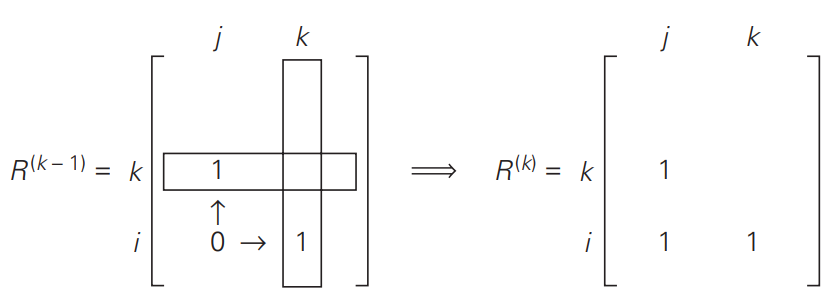

# 动态规划

动态规划通过组合子问题的解来求解原问题。
与分治法相比，分治法是把问题划分为互不相交的子问题；而动态规划应用于子问题重叠的情况。

## 计算Fibnacci数

$$
F(n) = F(n-1) + F(n-2) \qquad F(0) = 0, F(1) = 1
$$

把计算$F(n)$这个问题分解为两个更小的交叠子问题$F(n-1)$和$F(n-2)$。

## 0-1背包问题

之前使用分支界限法求解0-1背包问题，也可以用贪心算法求解部分背包问题。

使用动态规划求解0-1背包问题，设$V[i, j]$是能放进重量为$j$的前$i$个物品最有价值子集的总价值。

对于第$i$个物品，如果背包空间不足，那一定不会考虑放它；
如果背包空间能容纳他，$V[i,j]$的含义是，前$i-1$个物品的最优子集加上第i个物品，
放入承受重量为$j-w_i$的背包。或者，不放入第$i$个物品，
前$i-1$个物品的最优子集放入承重为$j$的背包。

```pesu
Algorithm OptimalKnapsack(w[1..n], v[1..n], W)
//Finds the items composing an optimal solution to the knapsack problem
//Input: Arrays w[1..n] and v[1..n] of weights and values of n items,
//       knapsack capacity W, and table V [0..n, 0..W] generated by
//       the dynamic programming algorithm
//Output: List L[1..k] of the items composing an optimal solution
k ← 0 //size of the list of items in an optimal solution
j ← W //unused capacity
for i ← n downto 1 do
    if V [i, j] > V [i − 1, j]
        k ← k + 1; L[k] ← i //include item i
        j ← j − w[i]
return L
```

## 传递闭包问题

Warshall算法计算有向图的传递闭包，$R^{(k)}$是矩阵中任意两点的路径中间点的数量不超过k个。

$R^{(0)}$就是有向图的邻接矩阵，$R^{(k)}$的计算只与$R^{(k-1)}$有关。



## 多源最短路径

Floyd算法，核心逻辑就是$i$和$j$之间的距离能否通过借道$k$来缩短。

```pesu
Algorithm Floyd(W[1..n, 1..n])
//Implements Floyd’s algorithm for the all-pairs shortest-paths problem
//Input: The weight matrix W of a graph with no negative-length cycle
//Output: The distance matrix of the shortest paths’ lengths
D ← W //is not necessary if W can be overwritten
for k ← 1 to n do
    for i ← 1 to n do
        for j ← 1 to n do
            D[i, j] ← min{D[i, j], D[i, k] + D[k, j]}
return D
```

## 最长公共子序列（LCS）

状态转移方程

$$
c[i, j]=
\begin{cases}
0 & i =0 \text{ or } j = 0 \\
c[i-1, j-1] + 1, & i, j > 0 \text{ and } x_i = y_i\\
\max(c[i, j-1], c[i-1, j]) & i, j >0 \text{ and } x_i \neq y_i
\end{cases}
$$
