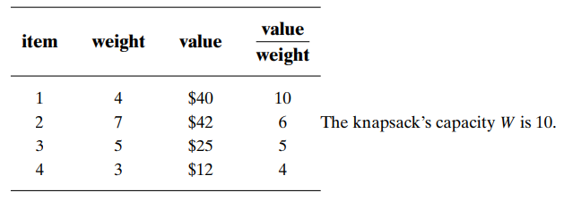

# 基于树的搜索

深度优先搜索、广度优先搜索

## 回溯法、分支界限法

回溯法的求解目标是找出T中满足约束条件的所有解，
而分支限界法的求解目标则是找出满足约束条件的一个解，
或是在满足约束条件的解中找出使某一目标函数值达到极大或极小的解，
即在某种意义下的最优解。

## 局部剪枝搜索（Local Beam Search）

局部剪枝搜索从k个随机生成的状态开始，
每步生成全部k个状态的所有后继状态，

- 如果其中之一是目标状态，算法停止；
- 态中选择最佳的k个状态继续搜索。

在局部剪枝搜索过程中，有用的信息在k个并行的搜索线程之间传递，
算法会很快放弃没有成果的搜索而把资源放在取得最大进展的搜索。

## 随机剪枝搜索

随机剪枝搜索不是选择最好的k个后代，
而是按照一定概率随机地选择k个后继状态。

选择给定后继状态的概率是状态值的递增函数，用随机来增加状态的多样性。
