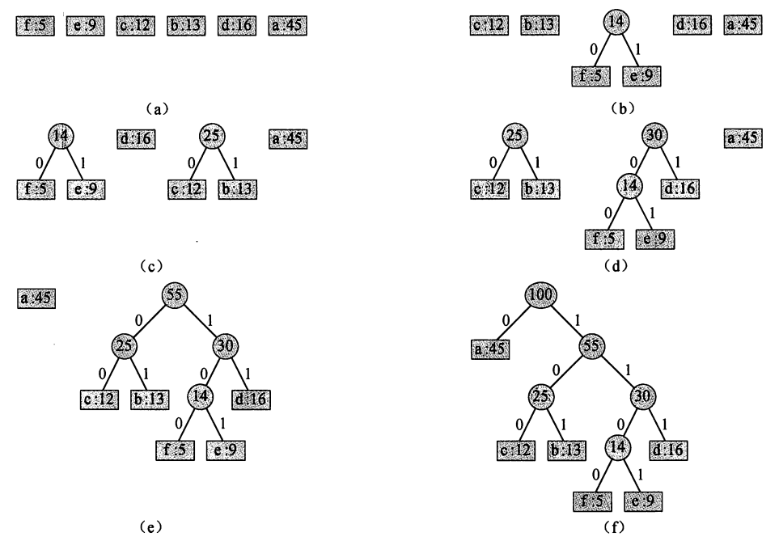

# 贪心算法

## Huffman编码



```pesu
HUFFMAN(C) 
1 n=ICI 
2 Q=C 
3 for i=1 to n—1 
4 allocate a new node z 
5 z.left = x = EXTRACT-MIN(Q) 
6 z.right = y = EXTRACT-MIN(Q) 
7 z.freq = x. freq + y. freq 
8 INSERT(Q, z) 
9 return EXTRACT-MIN(Q) 
```

## Kruskal算法

对所有的边排序，从权重较小的边开始遍历，判断能否加入到结果集合中。

对所有边进行排序：$O(|E|\lg |E|)$，

从最小的边开始遍历：$O(E)$，

判断该边能否加入到结果中，也就是判断边的两个顶点是否在同一集合中，
使用并查集数据结构，查找的速度快，$O(1)$，查找后需要合并操作，$O(\lg |V|)$。
因为$E \le V^2$，所以$\lg|E| = O(\lg V)$。
总体时间复杂度为$O(|E|\lg |V|)$。

## Prim算法

从初始根节点开始，每次增加一条最小的安全边。

使用最小堆：排序的不在树中的结点到树的最小边的权重

8-11行更新弹出结点后，堆中其余结点权重更新。

```pesu
MST-PRIM(G,w,r) 
1 for each uEG. V 
2     u.key = INFTY 
3     u:father = NIL 
4 r:key=0 
5 Q=G.V 
6 while Q is not empty
7     u= EXTRACT-MIN(Q) 
8     for each v in G.Adj[u] 
9     if vE Q and w(u,v) < v.key 
10     v.father = u
11     v. key = w(u,v) 
```

## 活动选择问题

区间贪心：优先选择最早结束的

## 0-1背包问题

没有贪心法解决方案，可以参考分支界限法求解0-1背包问题。
但贪心算法可以求解部分背包问题（Fractional Knapsack Problem）。

所谓部分背包问题，就是可以将0-1背包问题中的每件物品只拿取一部分，而不是拿整个物品。

